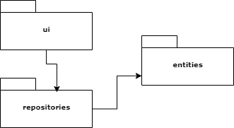
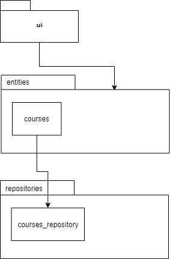
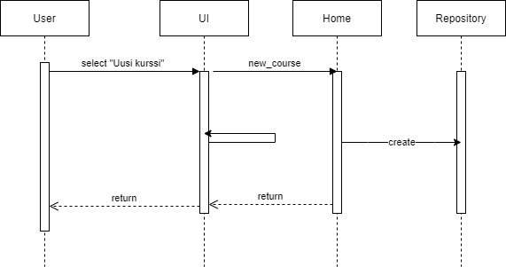

# Arkkitehtuurikuvaus

## Rakenne

Ohjelman koodin pakkausrakenne:

Pakkaus ui sisältää käyttöliittymän ja repositories tietokannan käsittelyyn liittyvät toiminnot. Pakkaus entities sisältää ohjelmassa käytetettävät pääluokat.

## Sovelluslogiikka

Ohjelman sovelluslogiikan kannalta oleelliset luokat:

## Sekvenssikaavio

Uuden kurssi luominen ohjelmalla:

## Käyttöliittymä

Ohjelma toimii merkkipohjaisena järjestelmänä. Päävalikosta valitaan toimintoja numeroilla.
Jos tehdään väärä valinta, ohjelma näyttää uudestaan päävalikon. 

Päävalikosta valitut toiminnota on toteutettu kaikki omina funktioina, jotka kutsuvat tietokannan käsittelyfunktioita
Käyttöliittymän kirjoitus, luku ja salasanan luku on toteutettu UI-luokkana.

## Tietojen tallennus

Kaikki tiedot tallennetaan SQLITE tietokantaan

Kannassa on taulut: 
- users (käyttäjätunnukset, salasanat)
- register (kursseille registeröinnit)
- courses(kurssinimi, opintopisteet, tenttipäivämäärä)

`Course_repository` huolehtii tietojen käsittelystä

## Ohjelmaan rakenteeseen jääneet heikkoudet

Ohjelman graaffinen käyttöliittymä jäi tulevaisuuden kehitysversioihin. UI-luokka antaa mahdollisuuden toteuttaa helposti graaffinen käyttöliittymän.
