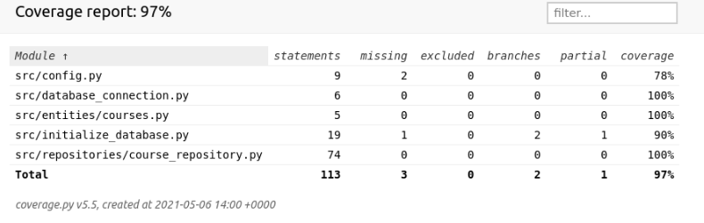

# Testausdokumentti

Ohjelmaan on tehty kattavat automatisoidut yksikkö- ja integraatiotestit unittestilla. Lisäksi on tehty manuaalisesti testausta.

## Yksikkö- ja integraatiotestaus

### Repositorio-luokat

Repositorio-luokkaa `CourseRepository` testataan tekemällä vastaavia tietokantatoimintoja. Testitietokannan nimi on konfiguroitu _.env.test_-tiedostoon. `CourseRepository`-luokkaa testataan [TestData](https://github.com/kalevat/ot-harjoitustyo/blob/master/src/tests/course_test.py)-testiluokalla.

### LoginMenu-luokka

Sisäänkirjautumisen luokkaa `LoginMenu` testataan tekemällä uusi käyttäjä ja tarkistamalla sisäänkirjautumisen toimivuus. `LoginMeny`-luokkaa testataan [TestLogin](https://github.com/kalevat/ot-harjoitustyo/blob/master/src/tests/login_test.py)-testiluokalla.

### Testauskattavuus

Käyttöliittymän valikkoja ei testata. Testauksen haarautumakattavuus on 97%

Testaamatta jäivät _build.py_- ja _initialize\_database.py_-tiedostojen suorittaminen komentoriviltä. Nämä olisi myös voinut jättää testikattavuuden ulkopuolelle. Lisäksi testaatamatta jäivät mm. tilanteet, joissa haetaan kirjautumattoman käyttäjän tekemättömät tehtävät ja uloskirjautuminen.

## Järjestelmätestaus

Sovelluksen järjestelmätestaus on suoritettu manuaalisesti.

### Asennus ja konfigurointi

Sovellus on haettu ja sitä on testattu [käyttöohjeen](./kayttoohje.md) kuvaamalla tavalla sekä macOS- että Linux-ympäristöön. Testauksessa on käytetty myös eri konfiguraatioita _.env_-tiedoston kautta.

Sovellusta on testattu sekä tilanteissa, joissa käyttäjät ja työt tallettavat tiedostot ovat olleet olemassa ja joissa niitä ei ole ollut jolloin ohjelma on luonut ne itse.

### Toiminnallisuudet

Kaikki [määrittelydokumentin](./vaatimusmaarittely.md#perusversion-tarjoama-toiminnallisuus) ja käyttöohjeen listaamat toiminnallisuudet on käyty läpi. Kaikkien toiminnallisuuksien yhteydessä on syötekentät yritetty täyttää myös virheellisillä arvoilla kuten tyhjillä.

## Sovellukseen jääneet laatuongelmat

Sovellus ei anna tällä hetkellä järkeviä virheilmoituksia, seuraavissa tilanteissa:

- Konfiguraation määrittelemiin tiedostoihin ei ole luku/kirjoitusoikeuksia
- SQLite tietokantaa ei ole alustettu, eli `python -m poetry run invoke build`-komentoa ei ole suoritettu
